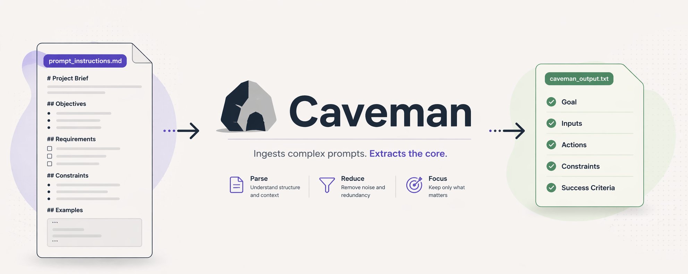

# Caveman

A CLI tool that compresses LLM system prompt files by removing bloat, redundancy, and filler — reducing token count, but without semantic loss.

## Why

Redundant instructions, verbose phrasing, filler phrases, and duplicate sentences are common in prompts written iteratively over time. This creates two problems:

- **Token cost** — every input token costs money and consumes context window space
- **Clarity cost** — bloated prompts are harder to maintain and audit

Running your prompt through it reveals redundancy that should either be removed automatically or fixed manually. It is as much a prompt linting tool as a compression tool.

Typical reduction:

- 20-35% for most initial LLM instruction prompts

## How it works

Caveman applies a fixed pipeline to your prompt file:

1. Strip markdown formatting
2. Protect code blocks and tables from modification
3. Remove filler phrases
4. Apply word and phrase substitutions
5. Remove duplicate sentences
6. Remove near-duplicate sentences via fuzzy matching
7. Normalise whitespace

## Installation

Requires Python 3.11+.

Install directly from PyPI:

```bash
pip install caveman-prompt
```

For accurate token counting:

```bash
pip install caveman[tiktoken]
```

## Usage

```bash
caveman -file my_prompt.md
```

Output is written to `my_prompt.txt` in the same directory by default.

**Options:**

| Flag         | Description                                          | Default                              |
| ------------ | ---------------------------------------------------- | ------------------------------------ |
| `-file`      | Input `.md` file                                     | required                             |
| `-o`         | Output file path                                     | input filename with `.txt` extension |
| `-rules`     | Custom `.toml` rules file                            | built-in `default.toml`              |
| `-tokenizer` | Token counter: `approx`, `cl100k_base`, `o200k_base` | `approx`                             |
| `-diff`      | Print a unified diff of all changes                  | off                                  |

**Examples:**

```bash
# Basic usage
caveman -file prompt.md

# Custom output path
caveman -file prompt.md -o compressed.txt

# Custom rules file with accurate token counting and diff
caveman -file prompt.md -rules custom.toml -tokenizer cl100k_base -diff
```

## Rules file

Rules are defined in TOML. The default ruleset covers common filler phrases, verbose constructions, and word substitutions.

```toml
[[rules]]
type = "exempt"
targets = ["code_blocks", "tables"]

[[rules]]
type = "strip"
target = "filler_phrases"
phrases = ["it is important to note that", "please note that", "basically"]

[[rules]]
type = "substitution"
from = "in order to"
to = "to"
case_insensitive = true

[[rules]]
type = "substitution"
from = "and"
to = "&"
case_insensitive = true

[[rules]]
type = "deduplicate"
scope = "sentences"

[[rules]]
type = "whitespace"
ops = ["remove_double_spaces", "remove_blank_lines", "remove_trailing_spaces"]
```

**Rule types:**

- `exempt` — protect blocks from modification. Targets: `code_blocks`, `tables`
- `strip` — remove phrases entirely. Target: `filler_phrases`
- `substitution` — replace one phrase with another
- `deduplicate` — remove exact duplicate sentences
- `whitespace` — normalise whitespace. Ops: `remove_double_spaces`, `remove_blank_lines`, `remove_leading_spaces`, `remove_trailing_spaces`

## Disclaimer

> Until Caveman reaches version 1.0.0, some bugs may be present. Please review outputs provided by the tool.

## License

MIT
